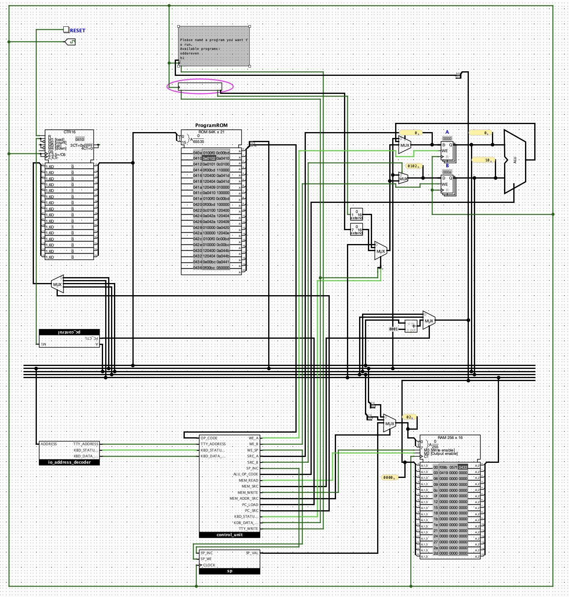
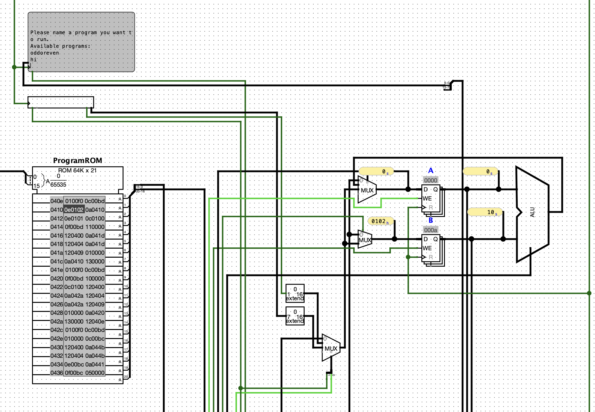
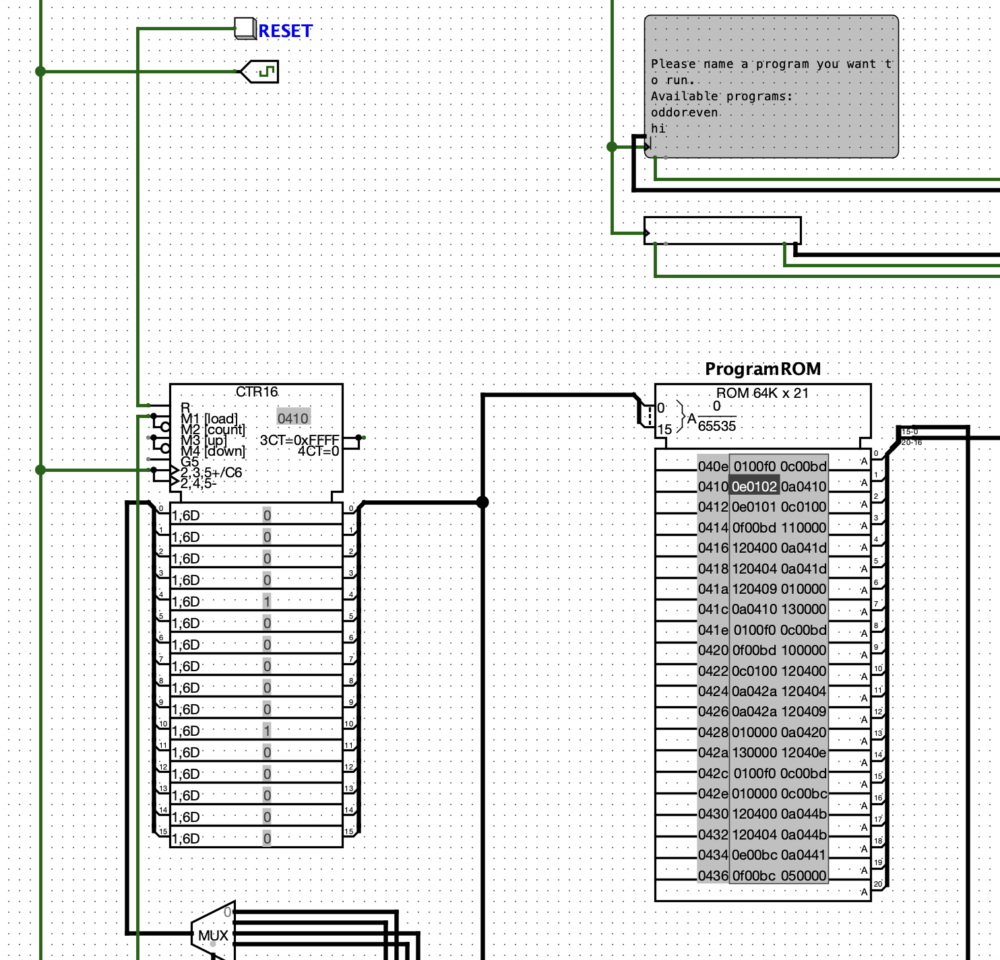
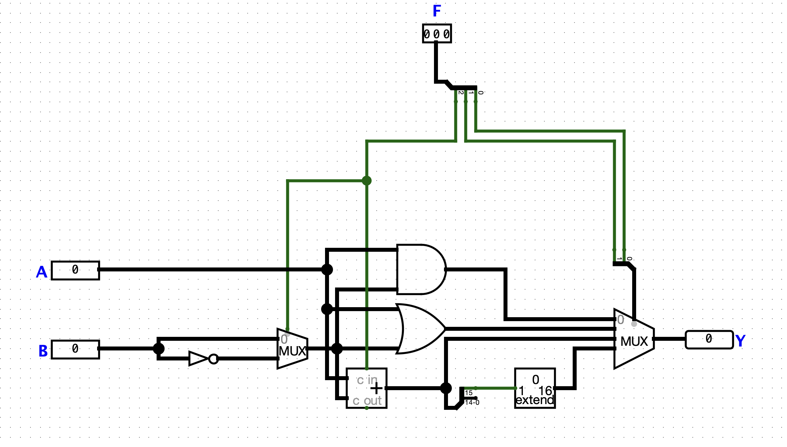

# Overengineering a Factorial — Logisim Circuits

This repository contains the **Logisim Evolution schematics** for the project
[Overengineering a Factorial](https://julia-em.dev/notes/cpu-factorial/)

---

## What is this?

The project started with a fairly modest goal: compute a factorial.

Instead of writing a small program, I ended up building a processor capable of running that program. Along the way, this naturally expanded into a complete (if minimal) system: an instruction set, an assembler, a memory model, memory-mapped I/O, and a small runtime layer that behaves like a very simple operating system.

At some point, the original goal stopped being the interesting part. What mattered instead was understanding how all of these pieces fit together and making them work as a coherent system.

---

## What’s inside this repository

This repository contains the **hardware implementation** of that system in **Logisim Evolution**.

More specifically, you will find:

* the CPU datapath (ALU, registers, buses)
* the control unit and instruction decoding logic
* ROM and RAM integration
* the stack mechanism used for `CALL` / `RET`
* support for indirect calls (`CALL_REG`)
* memory-mapped I/O connections

All of this is implemented explicitly at the circuit level. The goal here is not abstraction, but visibility: being able to follow how an instruction is fetched, decoded, and executed as actual signal flow.

---

## System overview

The processor is intentionally minimal, but complete enough to run non-trivial programs.

It has a small register set (`A`, `B`, `PC`, `SP`), a basic ALU supporting arithmetic and logical operations, and a compact instruction set with conditional jumps and proper function calls. Control flow is simple but expressive enough to build structured programs, including dynamic dispatch via `CALL_REG`.

Memory is split into ROM and RAM. ROM stores code (including the OS), while RAM is used for the stack, variables, and a program table constructed at runtime. Input and output are implemented via memory-mapped addresses, so the same load/store instructions are used to interact with both memory and devices.

On top of this, a small **tinyOS** lives in ROM. It provides basic input/output routines, builds a program table in RAM, and implements a simple loop that allows the user to select and run programs by name.

---

## Screenshots

---

## Opening the Circuits

To run the circuits you will need **Logisim Evolution**:

[https://github.com/logisim-evolution/logisim-evolution](https://github.com/logisim-evolution/logisim-evolution)

After installing it, open the `.circ` file in this repository.

From there, you can step through execution, inspect signals, and see how instructions are translated into actual data movement inside the processor.

---

## Why this exists

This project is not about solving a computational problem efficiently.

It is about making the system visible end to end: from assembly code, to machine encoding, to control signals, to execution in hardware. Most of the time, these layers are either hidden or taken for granted. Here, they are deliberately exposed and constructed piece by piece.

The slightly ironic part is that, by the time the system is complete, computing the factorial itself becomes an exercise in execution rather than design. The original goal is still there, but it no longer carries the same weight.

That shift is intentional. The project is less about the result and more about the path that makes the result possible.
