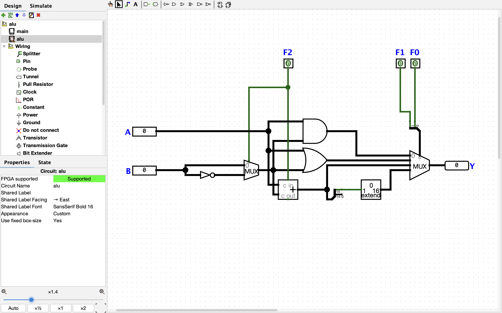
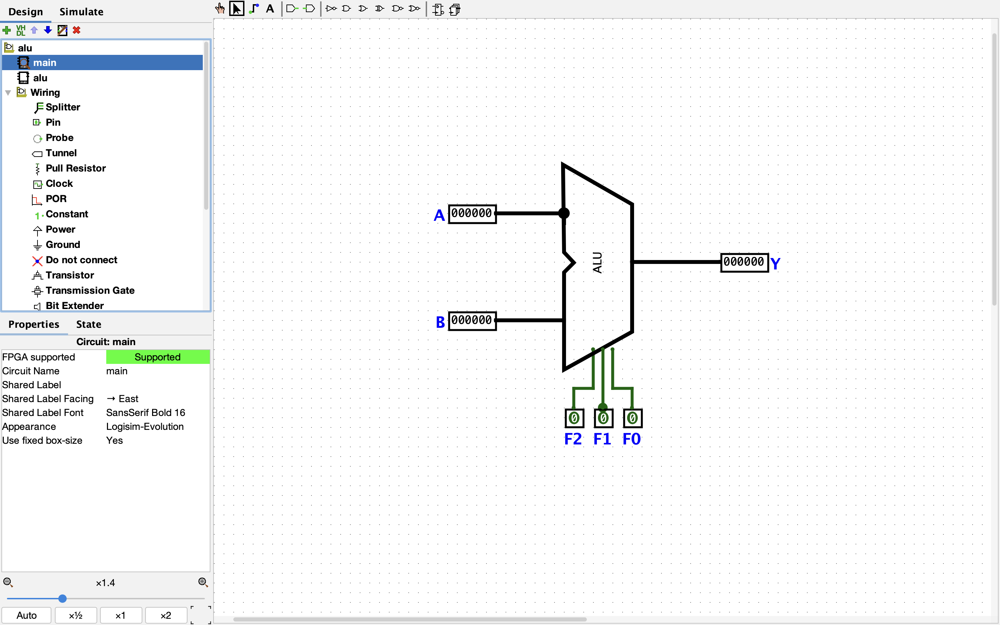

# Part 1 — ALU

This directory contains the **Logisim Evolution circuits for the ALU** described in the first article of the series *Overengineering a Factorial* - [Overengineering a Factorial. Part 1, The ALU.](#) *(link coming soon)*

The goal of this stage is to build a minimal **Arithmetic Logic Unit** capable of performing several logical and arithmetic operations. This component will later become the computational core of the processor developed in the series.

The circuits here demonstrate:

- basic logic gates
- multiplexers
- a simple ALU controlled by operation codes

You can read the full explanation in the article:

→ [Overengineering a Factorial. Part 1, The ALU.](#)*(link coming soon)*

## Circuit Preview

The ALU subcircuit:

The main circuit:

## Series

This circuit is part of the project:

→ [Overengineering a Factorial](#)*(link coming soon)*