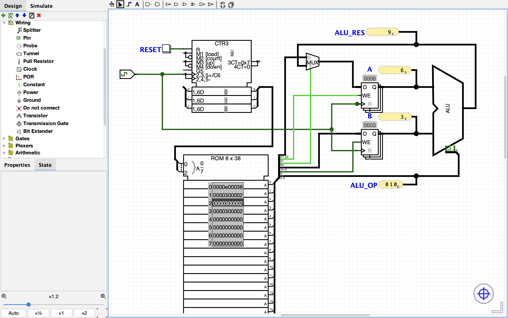

## Overengineering a Factorial. Part 2, Registers

This directory contains the **Logisim Evolution circuits** described in the second article of the series *Overengineering a Factorial* —  
[Overengineering a Factorial. Part 2, Registers](#) *(link coming soon)*

The circuit consists of two parts.

The first part is a simple setup for testing the ROM together with the ALU using single-instruction programs.  
Use the corresponding ROM content file to run these tests.

The second part is the actual processor circuit, which includes registers, a program counter, and a clock.  
You can test it by running a program that computes 3 × 3.

## Circuit Preview

## Series

This circuit is part of the project:

→ [Overengineering a Factorial](#) *(link coming soon)*