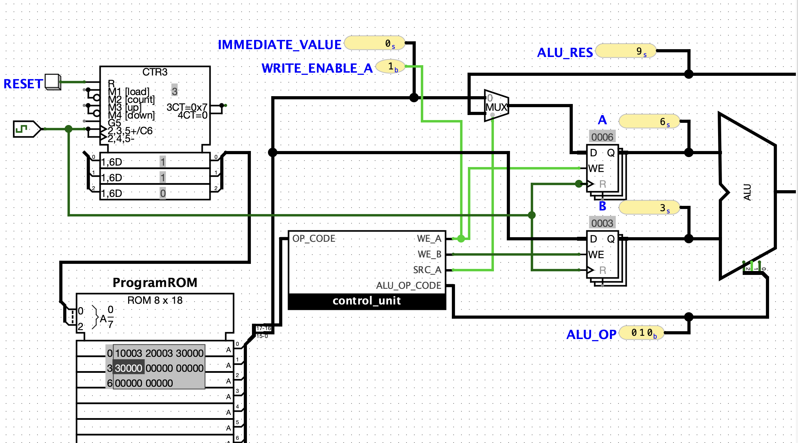

## Overengineering a Factorial. Part 4, Assembly and ISA

This directory contains the **Logisim Evolution circuits** described in the forth article of the series *Overengineering a Factorial* —  
[Overengineering a Factorial. Part 4, Assembly and ISA](https://julia-em.dev/notes/cpu-factorial-part-4-assembly-and-isa/)

In this chapter we develop our own assembly language and extend Instruction Set Architecture for our processor

## Circuit Preview

## Series

This circuit is part of the project:

→ [Overengineering a Factorial](https://julia-em.dev/notes/cpu-factorial/)