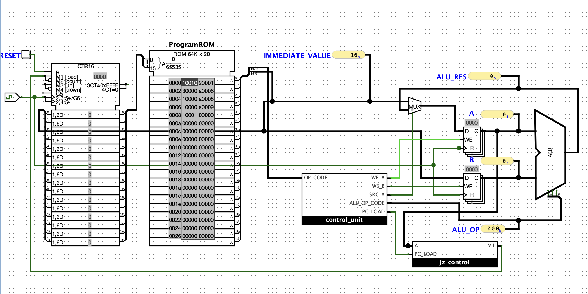

## Overengineering a Factorial. Part 5, Control Flow

This directory contains the **Logisim Evolution circuits** described in the fifth article of the series *Overengineering a Factorial* —  
[Overengineering a Factorial. Part 5, Branching.](https://julia-em.dev/notes/cpu-factorial-part-5-branching/)

In this chapter we introduce *jz* instruction to control the program flow.

## Circuit Preview

## Series

This circuit is part of the project:

→ [Overengineering a Factorial](https://julia-em.dev/notes/cpu-factorial/)