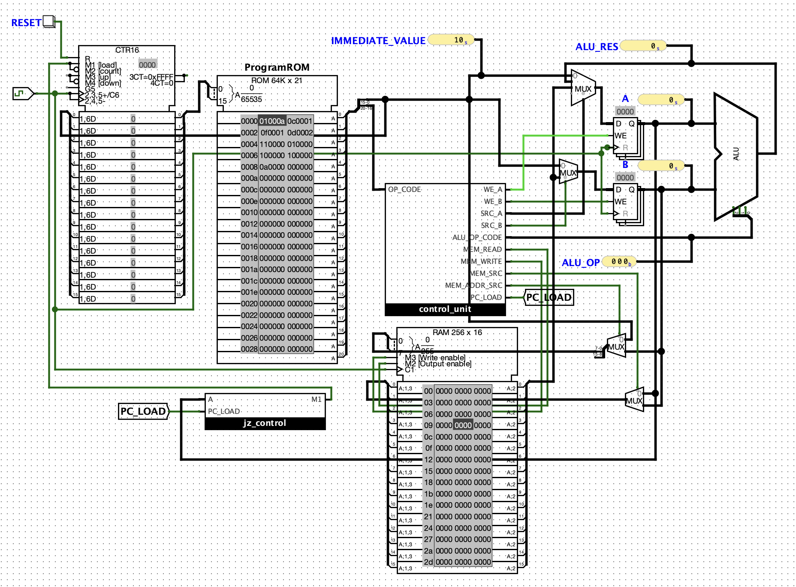

## Overengineering a Factorial. Part 5, Control Flow

This directory contains the **Logisim Evolution circuits** described in the sixth article of the series *Overengineering a Factorial* —  
[Overengineering a Factorial. Part 6, RAM.](https://julia-em.dev/notes/cpu-factorial-part-6-ram/)

In this chapter we add a RAM, build up data path and learn how to store and retrieve data from memory.

## Circuit Preview

## Series

This circuit is part of the project:

→ [Overengineering a Factorial](https://julia-em.dev/notes/cpu-factorial/)